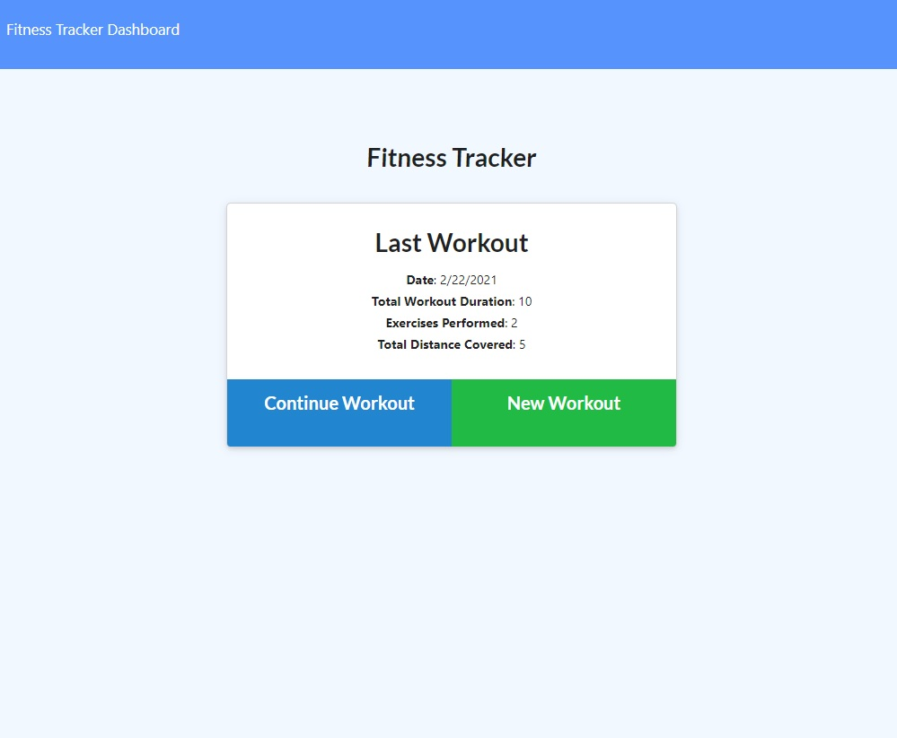

<h1 align="center"> Workout Tracker </h1>

## Table of Contents
- [Description](#description)
- [Installation](#install)
- [Deployment](#deployed)
- [License](#license)
- [Questions](#questions)

## Description
A workout tracker app that allows the user to view create and track daily workouts, log multiple exercises in a workout on a given day, track the name, type, weight, sets, reps, and duration of exercise, and if the exercise is a cardio exercise, track the distance traveled.

## Installation
- npm install
- npm run seed
- npm start or node server

## Deployed Site
https://arcane-escarpment-05040.herokuapp.com/?id=6034494ce1ebf90015766093

## Screenshot

## License

## Questions
Github: https://github.com/esober101

Email: ericscottober@gmail.com